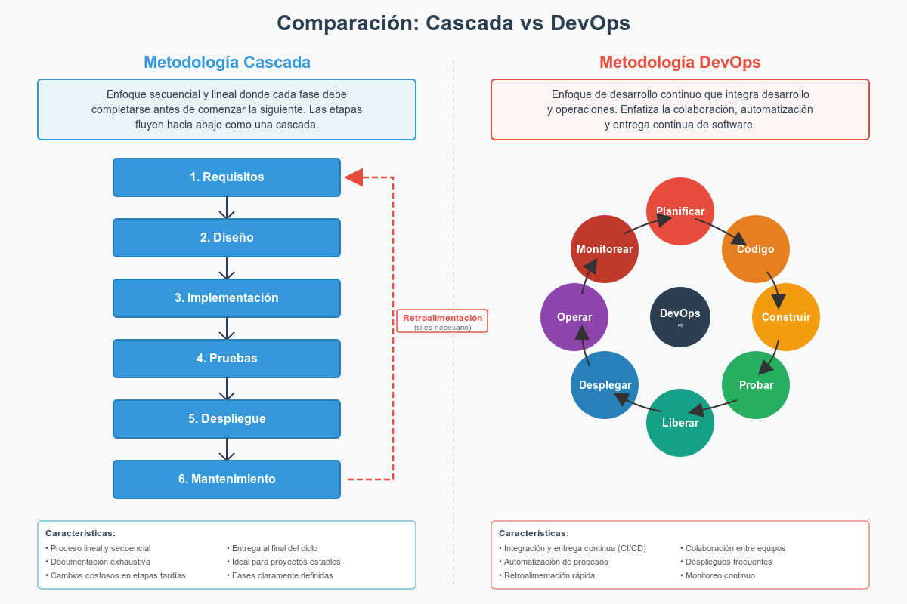
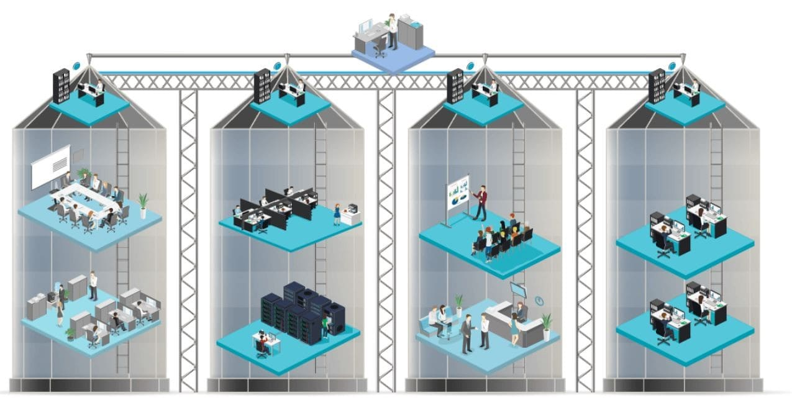

# Actividad 1-CC3S2

## Información

- Nombre: Ángel Aarón Flores Alberca
- Fecha de presentación: 03-09-25
- Tiempo invertido: 00:55
- Entorno:
  - Editor de texto: Zed
  - Desarrollo de diagramas: Excalidraw
  - Sistema operativo: Ubuntu 22.04 LTS

## 1. DevOps vs. Cascada Tradicional
#### ¿Por qué DevOps funciona mejor para software en la nube?

La diferencia más grande que veo entre DevOps y cascada es el tema del feedback. En cascada puedes pasar meses desarrollando algo y recién al final te das cuenta que no era lo que el cliente quería. Con DevOps, cada semana o incluso días tienes feedback real de usuarios.

Para aplicaciones web y móviles, esto es clave porque:
- Los usuarios cambian de opinión rápido
- La competencia innova constantemente
- Un bug en producción se puede arreglar en horas, no meses

El tema de lotes pequeños también me parece fundamental. Prefiero integrar 10 cambios de 20 líneas que 1 cambio de 200 líneas. Es más fácil encontrar qué se rompió.

### Cuándo cascada todavía tiene sentido

Después de investigar un poco, creo que cascada sigue siendo necesaria en **sistemas médicos con certificación FDA**.

**Criterios que justifican cascada:**
1. **Documentación regulatoria:** Cada línea de código necesita documentación formal aprobada por la FDA
2. **Trazabilidad completa:** Cualquier cambio requiere re-validación de todo el sistema (puede tomar 12-18 meses)

**Los trade-offs son claros:**
- Velocidad: Un cambio simple puede tomar 1-2 años vs 1-2 semanas en DevOps
- Seguridad/Cumplimiento: Literalmente pueden morir personas si algo falla, entonces vale la pena la lentitud

## 2. Ciclo Tradicional de Dos Pasos y Silos

### El problema de "desarrollo → operaciones"

En mi experiencia (aunque limitada), he visto esto en proyectos universitarios donde un grupo hace el frontend, otro el backend, y al final nadie sabe cómo juntar todo. A nivel empresarial debe ser peor.

**Dos problemas que identifico:**

1. **Integración de último minuto:** Cuando cada equipo trabaja por separado por meses, al momento de juntar todo salen conflictos que nadie esperaba. Es como armar un rompecabezas donde cada persona hizo piezas sin coordinar.

2. **El juego del teléfono descompuesto:** Los bugs que encuentra el equipo de operaciones tienen que explicárselos al equipo de desarrollo, pero sin contexto completo. Esto genera interpretaciones incorrectas y soluciones que no atacan la raíz del problema.

### Anti-patrones que empeoran todo

**"Throw over the wall":**
Es como cuando en un trabajo en grupo alguien hace su parte y se la manda por WhatsApp a otro diciéndole "ahí está, ya es tu problema". Sin explicación, sin documentación, sin quedarse a ayudar si algo falla.

Esto hace que cuando algo se rompe en producción, el equipo de operaciones tiene que ser detective para entender qué hace el código, mientras el equipo de desarrollo dice "pero en mi máquina funcionaba".

**Seguridad como inspector final:**
Es como revisar si tu casa es segura después de que ya la construiste. Obvio que vas a encontrar problemas, pero ahora cambiar las bases o la estructura cuesta 10 veces más que haberlo planeado desde el principio.
